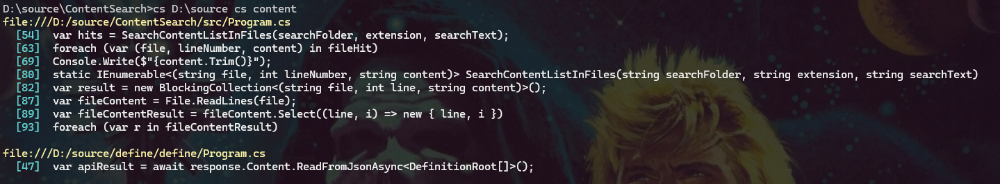

## Introduction

Content Search is command line tool that searches files for text. It is intended as an extremely simple grep-like tool and generates output as clickable links (assuming the user is using Windows Terminal).

## Download

Compiled downloads are not available.

## Compiling

To clone and run this application, you'll need [Git](https://git-scm.com) and [.NET](https://dotnet.microsoft.com/) installed on your computer. From your command line:

```
# Clone this repository
$ git clone https://github.com/btigi/ContentSearch

# Go into the repository
$ cd src

# Build  the app
$ dotnet build
```

## Usage

```cs directory extension searchtext```

e.g.
```ContentSearch C:\source cs enumerable```

cs will run a case-insensitive scan the specified directory and all sub-directories. The output will include a file:// link to each file with matching text - in Windows Terminal this can be clicked to open the file in the associated application




## Licencing

Content Search is licenced under CC BY-NC-ND 4.0 https://creativecommons.org/licenses/by-nc-nd/4.0/ Full licence details are available in licence.md